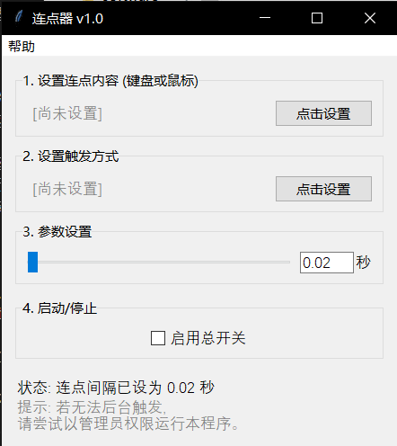

# 连点器 v1.0

一款由十四独立开发的、纯净、免费、开源的Windows连点器软件。

## ✨ 功能特性

- **自定义按键**: 支持连点键盘上的任意按键，或鼠标左、中、右键。
- **自定义触发**: 支持使用键盘或鼠标宏按键作为启动/停止连点的开关。
- **速率可调**: 提供可视化滑条，可自由设定 0.01 ~ 2.00 秒的连点间隔。
- **智能监听**: 程序在后台全局监听触发键，无需将窗口置于顶层。
- **安全稳定**: 纯本地运行，不联网，不读取无关文件，采用稳健的多线程模型，响应迅速。
- **体验优雅**: 界面自适应高分屏，启动无闪烁，所有窗口居中显示，并提供人性化的交互提示。

## 🚀 如何使用

1.  **下载**: 从本页面的 [**Releases**](https://github.com/14isfourteen/Auto-Clicker/releases/latest) 部分下载最新版本。
    - **推荐**: 下载 **`连点器_v1.0.zip`** 压缩包。这可以有效避免浏览器的安全警告。
    - **备选**: 您也可以直接下载 **`连点器 v1.0.exe`** 文件。

2.  **解压与运行**:
    - 如果您下载的是 `.zip` 文件，请先解压，然后双击运行 `.exe` 文件。
    - 如果您直接下载了 `.exe`，直接双击运行即可。
    > **⚠️ 首次运行提示**: Windows Defender可能会弹出蓝色警告框。请点击“**更多信息**” -> “**仍要运行**”。本软件完全开源，100%安全，请放心使用。

## 💬 作者的话

这是我选择程序设计专业以来，第一个自己从零开始“搓”出来的软件。最初的起因，是想帮一位同学跳过游戏剧情。在这个过程中，我遇到了无数的bug，也收获了朋友和AI的许多帮助。

我知道网络上有很多同类软件，但我还是想自己做一个，一个纯净、无广告、注入了自己思考和故事的作品。

希望大家用得开心！如果你有任何bug反馈或功能建议，欢迎通过“帮助”->“关于”里的联系方式找到我。

—— 十四
